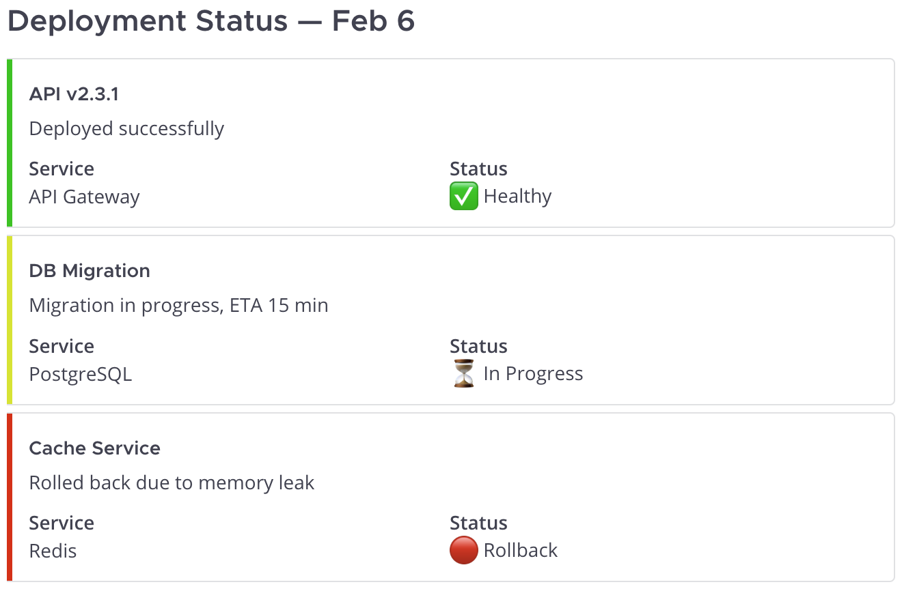
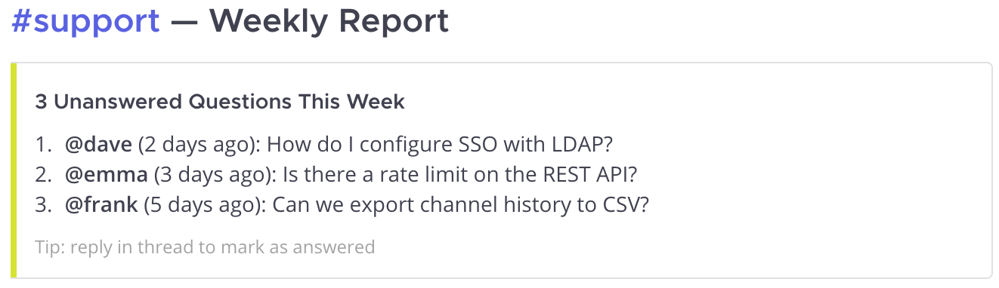
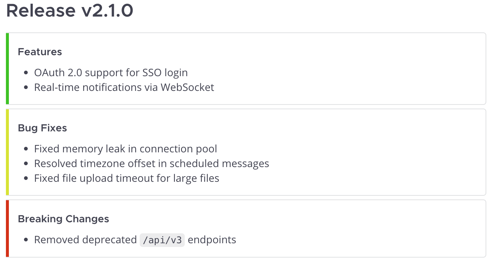

# Examples

Realistic scenarios showing how AI assistants use MCP Server Mattermost.
Each example is a single prompt — the AI decides which tools to call and how to format the result.

## Deployment Status Summary

> "Check #ops for today's deployment messages and post a summary to #engineering"

The AI reads recent messages from #ops, identifies deployment-related updates,
and posts a structured summary to #engineering with color-coded status:

<div class="examples-screenshot">



</div>

<details>
<summary>How it works</summary>

**Tools used:**

1. `get_channel_by_name` — find #ops channel
2. `get_channel_messages` — read recent messages
3. `post_message` — post summary to #engineering with attachments

**Example attachment payload:**

```json
{
  "channel_id": "engineering-channel-id",
  "message": "",
  "attachments": [
    {
      "color": "good",
      "title": "API v2.3.1",
      "text": "Deployed successfully",
      "fields": [
        {"title": "Service", "value": "API Gateway", "short": true},
        {"title": "Status", "value": "Healthy", "short": true}
      ]
    },
    {
      "color": "warning",
      "title": "DB Migration",
      "text": "Migration in progress, ETA 15 min",
      "fields": [
        {"title": "Service", "value": "PostgreSQL", "short": true},
        {"title": "Status", "value": "In Progress", "short": true}
      ]
    },
    {
      "color": "danger",
      "title": "Cache Service",
      "text": "Rolled back due to memory leak",
      "fields": [
        {"title": "Service", "value": "Redis", "short": true},
        {"title": "Status", "value": "Rollback", "short": true}
      ]
    }
  ]
}
```

</details>

---

## Unanswered Questions Report

> "Find unanswered questions in #support from this week and post a summary for the team"

The AI searches for questions, checks each thread for replies,
and posts a report highlighting what still needs attention:

<div class="examples-screenshot">



</div>

<details>
<summary>How it works</summary>

**Tools used:**

1. `search_messages` — find messages with questions in #support
2. `get_thread` — check each thread for replies
3. `post_message` — post summary with unanswered items

**Example attachment payload:**

```json
{
  "channel_id": "support-channel-id",
  "message": "",
  "attachments": [{
    "color": "warning",
    "title": "3 Unanswered Questions This Week",
    "text": "1. **@dave** (2 days ago): How do I configure SSO with LDAP?\n2. **@emma** (3 days ago): Is there a rate limit on the REST API?\n3. **@frank** (5 days ago): Can we export channel history to CSV?",
    "footer": "Tip: reply in thread to mark as answered"
  }]
}
```

</details>

---

## Release Announcement

> "We just shipped v2.1.0. Check the last week of #dev and #bugfixes, then post release notes to #releases"

The AI gathers changes from team conversations and assembles
structured release notes — grouped by category, each with its own color:

<div class="examples-screenshot">



</div>

<details>
<summary>How it works</summary>

**Tools used:**

1. `get_channel_by_name` — find #dev and #bugfixes channels
2. `get_channel_messages` — read last week of messages from both
3. `post_message` — post categorized release notes to #releases

**Example attachment payload:**

```json
{
  "channel_id": "releases-channel-id",
  "message": "## Release v2.1.0",
  "attachments": [
    {
      "color": "good",
      "title": "Features",
      "text": "- OAuth 2.0 support for SSO login\n- Real-time notifications via WebSocket"
    },
    {
      "color": "warning",
      "title": "Bug Fixes",
      "text": "- Fixed memory leak in connection pool\n- Resolved timezone offset in scheduled messages\n- Fixed file upload timeout for large files"
    },
    {
      "color": "danger",
      "title": "Breaking Changes",
      "text": "- Removed deprecated `/api/v3` endpoints"
    }
  ]
}
```

</details>

---

## Daily Channel Digest

> "Catch me up on #backend — what happened while I was away?"

The AI reads recent channel history, groups messages by topic,
and returns a summary directly to you:

**Tools used:**

1. `get_channel_by_name` — find #backend channel
2. `get_channel_messages` — fetch recent messages

The AI then analyzes the messages and responds with a structured summary —
decisions made, open questions, and action items. No message is posted
to Mattermost; the summary stays in your conversation with the AI.

---

## Project Kickoff

> "Set up a channel for Project Phoenix — private, invite @alice, @bob and @carol, and post a welcome message with the project goals"

A single prompt triggers a chain of 7+ tool calls:

**Tools used:**

1. `create_channel` — create private channel `project-phoenix`
2. `get_user_by_username` — look up @alice, @bob, @carol (3 calls)
3. `add_user_to_channel` — invite each user (3 calls)
4. `post_message` — post welcome message with project goals

The AI handles the entire workflow: channel creation, user lookup,
invitations, and the welcome post — all from one sentence.

---

## Thread Follow-up

> "Check if anyone replied to my question about the API migration in #backend, and if not — ping the team"

The AI checks context and decides what to do:

**Tools used:**

1. `search_messages` — find your original question
2. `get_thread` — check if anyone replied

**If no replies:** the AI posts a reminder in the same thread using
`post_message` with `root_id`, keeping the conversation organized.

**If replies exist:** the AI summarizes the responses for you instead.
